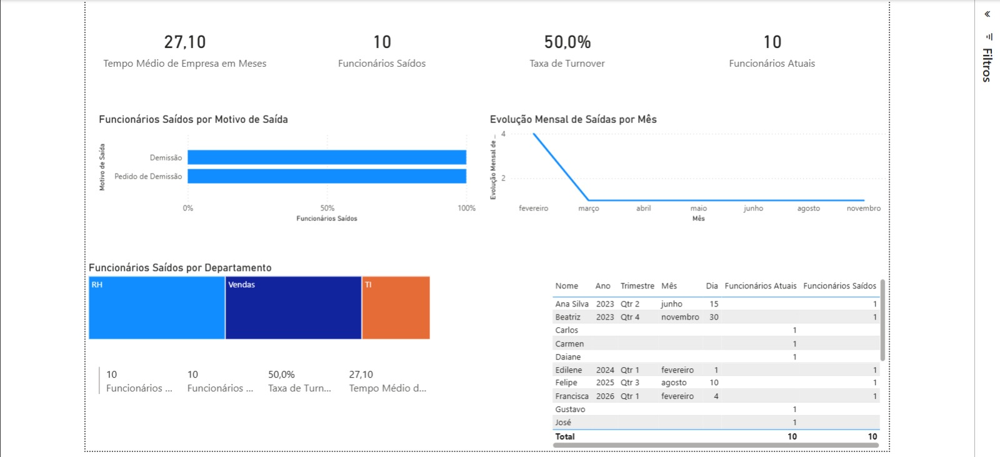

# 📊 Dashboard de Análise de RH - Turnover

Dashboard interativo para análise de turnover (rotatividade) de funcionários desenvolvido em Power BI.

## 🎯 Objetivo
Analisar métricas de turnover como taxa de rotatividade, tempo médio de empresa, motivos de saída e distribuição por departamento.

## 📈 Métricas Calculadas
- **Funcionários Atuais**: 10
- **Funcionários Saídos**: 10  
- **Taxa de Turnover**: 50%
- **Tempo Médio de Empresa**: 27,1 meses

## 🛠️ Tecnologias Utilizadas
- **Power BI Desktop** para desenvolvimento do dashboard
- **DAX (Data Analysis Expressions)** para cálculos avançados
- **Power Query** para transformação de dados
- **Excel** como fonte de dados

## 📊 Visualizações Incluídas
1. **Cartões de Métricas**: KPIs principais
2. **Gráfico de Linha**: Evolução mensal de saídas
3. **Mapa de Árvore**: Distribuição por departamento
4. **Gráfico de Barras**: Motivos de saída
5. **Tabela Detalhada**: Dados individuais dos funcionários

## 📁 Estrutura do Projeto
powerbi-rh-turnover-dashboard/
├── README.md
├── images/dashboard-full.png
├── dados_turnover.xlsx
└── Dashboard de Turnover - Análise de RH.pbix

## 🚀 Como Executar
1. Baixe o arquivo `Turnover_RH.pbix`
2. Abra no **Power BI Desktop** (disponível gratuitamente)
3. Os dados já estão incluídos no arquivo

## 📸 Preview

## 🔍 Insights Identificados
- Taxa de turnover de 50% no período analisado
- Departamento de Vendas com maior número de saídas
- "Pedido de Demissão" foi o motivo mais comum
- Pico de saídas no primeiro trimestre

## 📚 Aprendizados
- Criação de medidas com DAX
- Transformação de dados com Power Query
- Design de dashboards interativos
- Análise de métricas de RH

## 👨‍💻 Autor
Lucas Magalhães Amaral
- GitHub: [@Twolker23](https://github.com/Twolker23)
- LinkedIn: www.linkedin.com/in/lucas-magalhaes-amaral

## 📄 Licença
Este projeto é de código aberto e está disponível para fins educacionais.
